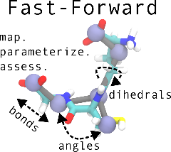

We are very happy to announce the publication of _Fast-Forward_. With
_Fast-Forward_, you can parameterize Martini models for systems of any size and
in any environment. The package features subprograms for trajectory mapping,
parameter generation, and model validation. Atomistic reference trajectories
and mapping data is used to generate pseudo-CG trajectories. From these, an
initial CG topology is constructed. This topology is successively improved by
comparing and fitting the distributions from trial runs with the reference
distributions. The tools offered by _Fast-Forward_ were designed to make use of
common file formats within the Martini ecosystem.

> Christopher Brasnett, Maximilian Fidlin, Thilo Duve, Sebastian Thallmair,
> Siewert J. Marrink, Fabian Grünewald. Fast-Forward: Automatic Assignment and
> Assessment of Bonded Parameters for the Martini Force Field. _Journal of
> Chemical Information and Modeling_. 2026.
> <https://doi.org/10.1021/acs.jcim.6c01107>

- Read the paper at [Brasnett et al. _J. Chem. Inf. Model._ (2026)](https://doi.org/10.1021/acs.jcim.6c01107).
- _Fast-Forward_ is developed on the [Martini Force Field Initiative GitHub](https://github.com/Martini-Force-Field-Initiative/fast_forward)
  and can be installed through `pip`.
